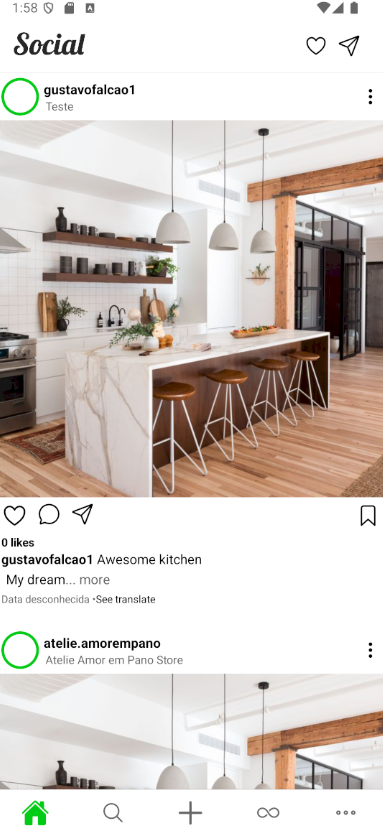
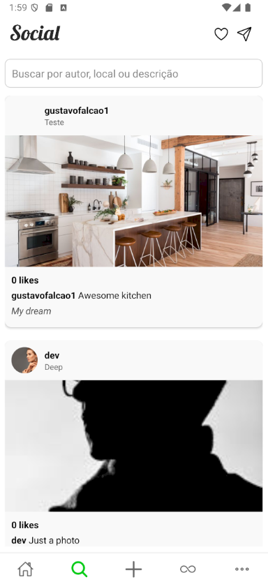
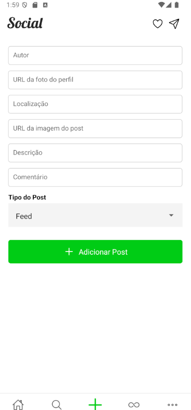

# 📱 Social App

**Social App** is a prototype mobile application developed using React Native with Expo. Designed as a proof of concept for social networking, it showcases essential features for user interactions, content sharing, and community building in a mobile-first experience.

---

## ✨ Features

- 📸 Content sharing (photos, status updates)
- 💬 Real-time messaging and notifications
- 👥 User profiles and friend lists
- ❤️ Likes and interaction feedback
- 📱 Responsive and intuitive UI

---

## 🛠️ Technologies

- **React Native**
- **Expo**
- **Firebase** (planned integration)
- **Yarn**
- **Node.js 22**

---

## 🚀 Getting Started

### 📥 Installation

Clone and set up the project:

```bash
git clone https://github.com/gustavofalcao1/Social.git
cd Social
yarn install
```

### ▶️ Run Application

Launch Expo development environment:

```bash
yarn start
```

Scan the QR code with Expo Go app on your Android or iOS device.

---

## 📸 Screenshots

| Feed Screen | Search Screen | Add Post Screen |
|-----------------------|----------------|-----------|
|  |  |  |
| Infinite Screen | Profile Screen |
|  |  

---

## 🤝 Contributing

Your contributions to improve and expand this project are welcomed:

1. Fork the repository
2. Create your branch (`git checkout -b feature/new-feature`)
3. Commit your changes (`git commit -m 'Add new feature'`)
4. Push changes (`git push origin feature/new-feature`)
5. Open a Pull Request

---

## 📄 License

Licensed under the **MIT License**.

---

## 👤 Author

**Gustavo Falcão**  
[GitHub @gustavofalcao1](https://github.com/gustavofalcao1)  
[Project Repository](https://github.com/gustavofalcao1/Social)

---
